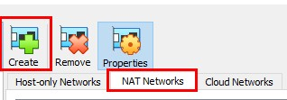
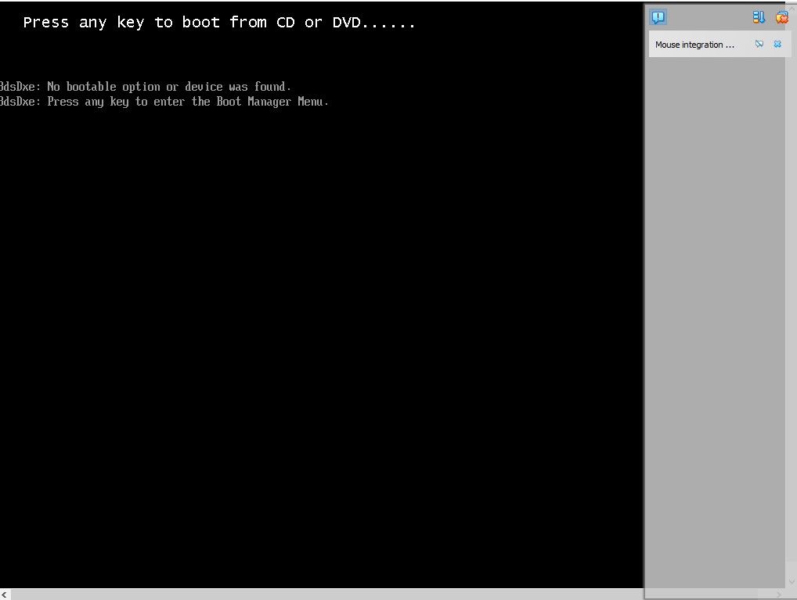
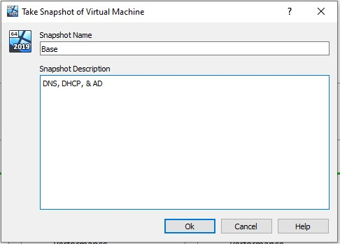
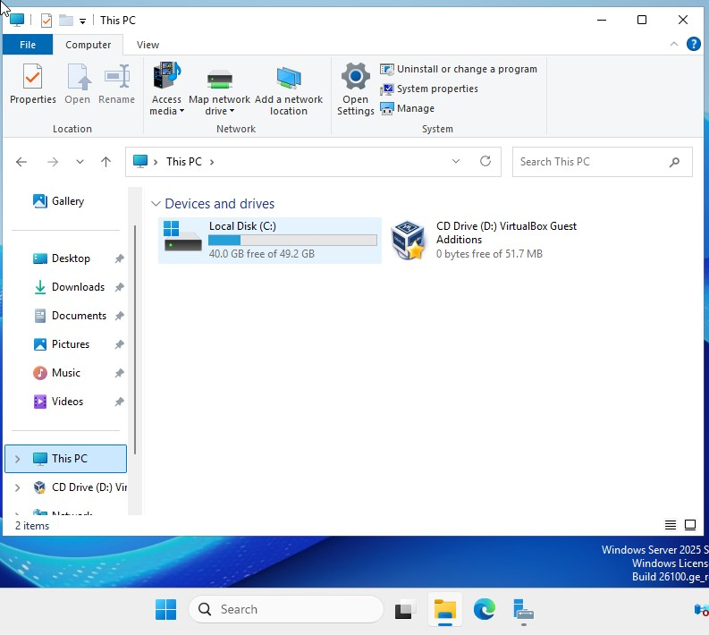
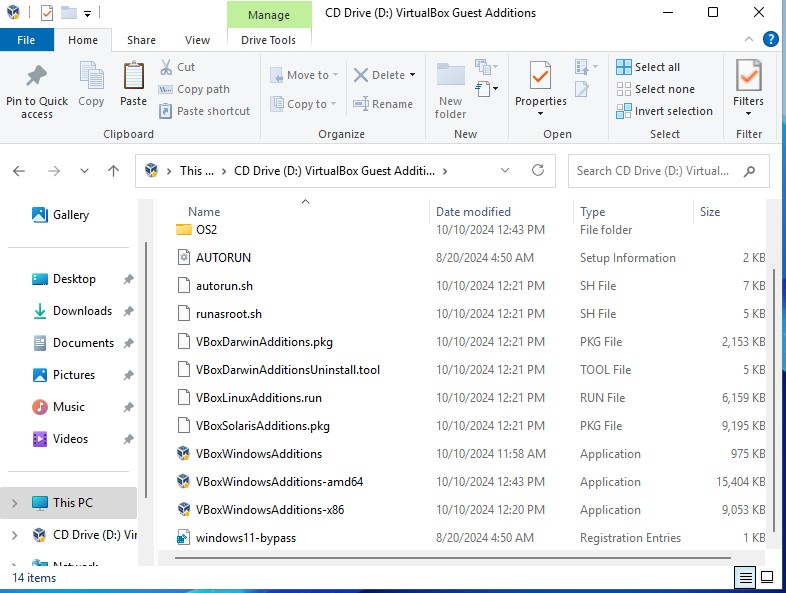
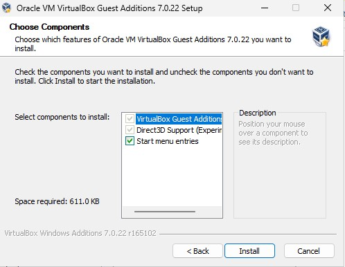
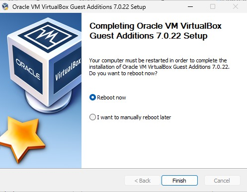

# 🧰 Installing KVM/QEMU on Ubuntu

## Installation Process

### Install KVM, QEMU, and Virtual Machine Manager

```bash
sudo apt update
sudo apt install -y qemu-kvm libvirt-daemon-system virt-manager

### Add your user to the libvirt group

```bash
sudo usermod -aG libvirt $USER
newgrp libvirt

KVM, QEMU, and Virtual Machine Manager is now ready for use. I use it to run virtual machines as part of my cybersecurity homelab setup.

---

**Set Up a New NAT Network in VirtualBox**

We’ll use a NAT Network to connect Virtual Machines (VMs) to each other and the internet.

1. Open VirtualBox.
2. Go to **File ➔ Tools ➔ Network Manager**.
3. Create a new NAT Network.


Select NAT Networks ➔ “Create”. 



At the bottom, name the NatNetwork `skynet-network` and choose an IPv4 prefix, refer to the Project Overview guide for more detail on IPv4 prefixes. Select “Apply” to save changes. Set the **IPv4 Prefix** to `10.0.0.0/24`.
8. Enable the **DHCP** option to allow automatic IP assignment.
9. Click **Apply** to save the configuration.


### Outcome:

This process created a NAT network named `skynet-network` with the subnet `10.0.0.0/24`. DHCP is enabled, meaning any virtual machines connected to this network will automatically receive an IP address.

> 💡 **Note**: By default, the `skynet-network` NAT Network will be selected for all newly provisioned Virtual Machines.

---

### Downloaded ISOs

I made sure to get the official installation ISO files for each operating system:

* **Windows Server 2025**: I found and downloaded the evaluation ISO.
* **Windows 11 Enterprise**: I downloaded this through my Microsoft account.
* **Ubuntu 24.04 Desktop**: I downloaded it from the [Ubuntu Official Site](https://ubuntu.com/download/desktop).
* **Ubuntu Server 24.04**: I also got this from the [Ubuntu Official Site](https://ubuntu.com/download/server).
* **Security Onion**: I downloaded the ISO from the [Security Onion Official Site](https://securityonionsolutions.com/download/).
* **Kali Linux 2024**: I chose the "Installer Images" option from the [Kali Linux Official Site](https://www.kali.org/get-kali/#kali-virtual-machines) for a clean install.

---

## Create A New Virtual Machine

Navigate to VirtualBox. Go to Machine ➔ New.


Enter a name for the Virtual Machine.

Choose default Folder location.

Select “Type: Microsoft Windows”. Version: “Windows Server 2025 (64-bit)” 


**Set Hardware Specifications**

Each virtual machine should have at least **4 GB of RAM (4096 MB)** and **2 CPUs**, unless stated otherwise.

> 💡 **Note**: 👉 Refer to the “Project Overview” guide for more information on default VM settings and names.

For Windows 11: Enable EFI.


Created a **dynamically allocated** virtual hard disk (unchecked “Pre-allocate”) with **50 GB** space.


Review specifications. Select “Finish”. 


### Attach ISO and Configure Network

Select the newly created virtual machine and open Settings. Under the Storage tab, click the Empty optical drive and choose Choose a disk file…. Locate your downloaded ISO file (typically in the Downloads folder) and click Open.

Next, go to the Network tab. Set Attached to as NAT Network, and choose skynet network in the Name dropdown. Click OK to apply the changes.


Select the Virtual Machine, then Select “Start”.


When the virtual machine starts, you'll see a prompt to press a key. Press any letter key to begin the operating system’s installation wizard.



---
## 📸 Virtual Machine Snapshot

A snapshot saves the exact state of a virtual machine at a specific point in time, including its disk, memory, and hardware settings. This allows you to revert back to that state if needed.

In VirtualBox, select the virtual machine, then click Take to create a snapshot.




Title the snapshot with something descriptive so you can recall what configurations were made up until this point.

#### Benefits of Taking Snapshots:
- 🛠️ **Experiment Safely**: Allows me to experiment with configurations without worrying about breaking the system.
- 🔄 **Easy Reverts**: If something goes wrong, I can easily revert to a previously saved state.
- ⏳ **Avoid Starting Over**: No need to start from scratch if mistakes happen snapshots help restore functionality quickly.

Using snapshots makes the setup process more efficient, recoverable, and flexible, allowing for smooth and controlled changes throughout the project.

---
## Enable Full Screen with VirtualBox Guest Additions

By default, VirtualBox virtual machines don’t run in full screen. To enable it, you can install **VirtualBox Guest Additions**, a set of drivers and system tools that improve VM performance and usability.

**For Windows 10/11:**

With the virtual machine running, go to the menu bar and select **Devices ➔ Insert Guest Additions CD image…**. This will mount the installer inside the VM. Follow the prompts to complete the installation.


Open the **File Explorer** in the Windows virtual machine. Navigate to **This PC**, then double-click the **VirtualBox Guest Additions** drive to open it.



Inside the VirtualBox Guest Additions folder, you’ll see several executable files. Double-click the generic VBoxWindowsAdditions program to start the installation.



Follow the default installation wizard settings.



Choose to "Reboot Now".



Allow the Virtual Machine to restart.

You should now be able to make the machine full screen. 

**For Linux - 🐧 Ubuntu & Kali Linux VMs**

- After inserting the CD, open the file manager and run:  
 `VBoxLinuxAdditions.run`

> 📸 **(Right-click → Open in Terminal → Run with sudo if needed)** 

> 📸 

     ```bash
     sudo ./VBoxLinuxAdditions.run

- You may need to install required packages beforehand:
     ```bash
     sudo apt update
     sudo apt install -y build-essential dkms linux-headers-$(uname -r)

- Reboot the VM after installation.

✅ Result

Once Guest Additions are installed and integration options are enabled:

- VMs can enter full-screen mode seamlessly.
- Clipboard and drag-and-drop work both ways between host and guest.
