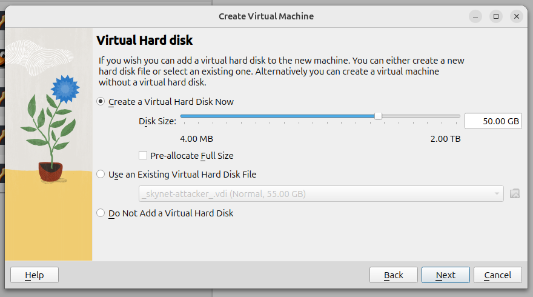
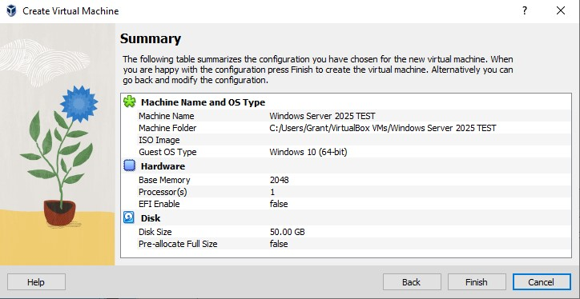

# 🧰 Installing VirtualBox on Ubuntu (From Official Site)

I installed **VirtualBox version 7.0.26r168464** by downloading the `.deb` package directly from the official Oracle VirtualBox website.

### Installation Steps:

1. **Go to the official download page**  
   👉 [https://www.virtualbox.org/wiki/Linux_Downloads](https://www.virtualbox.org/wiki/Linux_Downloads)

2. **Download the Debian package** for your Ubuntu version (e.g., `Ubuntu 20.04`, `22.04`, etc.)

3. **Install the package using your terminal**
   ```bash
   cd ~/Downloads
   sudo dpkg -i virtualbox-7.0_*.deb

4. **Fix any missing dependencies (if needed)**
   ```bash
   sudo apt --fix-broken install

5. **Verify the installation**
   ```bash
   virtualbox --help

VirtualBox is now ready for use. I use it to run virtual machines as part of my cybersecurity homelab setup.
   ```
   ✅ Version installed: VirtualBox 7.0.26r168464 on Ubuntu Linux
   ```
---
## Host Key in VirtualBox

The **Host Key** is a special key (typically the **Right CTRL**) that lets you interact with VirtualBox instead of the guest operating system inside the virtual machine (VM). It's used to exit the VM and return to the host system.

### Default Host Key:

- The default is usually the **Right CTRL** key, but it may vary based on your system or preferences.

**Purpose:**

The Host Key allows you to:

**1. Release Input:** If the VM has captured your keyboard or mouse, pressing the Host Key returns control to the host system.

**2. Access VirtualBox Features:** Use key combinations to perform actions like switching to full-screen, capturing screenshots, or opening the VirtualBox menu.

To check your current Host Key, go to **File ➔ Preferences** in VirtualBox.


Go to **Input ➔ Host Key Combination** to view or change the Host Key. To set a new key, select the box and press the desired key on your keyboard.


---
**Set Up a New NAT Network in VirtualBox**

We’ll use a NAT Network to connect Virtual Machines (VMs) to each other and the internet.

1. Open VirtualBox.
2. Go to **File ➔ Tools ➔ Network Manager**.
3. Create a new NAT Network.


Select NAT Networks ➔ “Create”. 


At the bottom, name the NatNetwork `skynet-network` and choose an IPv4 prefix, refer to the Project Overview guide for more detail on IPv4 prefixes. Select “Apply” to save changes. 


> 💡 **Note**: By default, the `skynet-network` NAT Network will be selected for all newly provisioned Virtual Machines.

---

### Downloaded ISOs

I made sure to get the official installation ISO files for each operating system:

* **Windows Server 2025**: I found and downloaded the evaluation ISO.
* **Windows 11 Enterprise**: I downloaded this through my Microsoft account.
* **Ubuntu 24.04 Desktop**: I downloaded it from the [Ubuntu Official Site](https://ubuntu.com/download/desktop).
* **Ubuntu Server 24.04**: I also got this from the [Ubuntu Official Site](https://ubuntu.com/download/server).
* **Security Onion**: I downloaded the ISO from the [Security Onion Official Site](https://securityonionsolutions.com/download/).
* **Kali Linux 2024**: I chose the "Installer Images" option from the [Kali Linux Official Site](https://www.kali.org/get-kali/#kali-virtual-machines) for a clean install.

---

## Create A New Virtual Machine

Navigate to VirtualBox. Go to Machine ➔ New.


Enter a name for the Virtual Machine.

Choose default Folder location.

Select “Type: Microsoft Windows”. Version: “Windows Server 2025 (64-bit)” 


**Set Hardware Specifications**

Each virtual machine should have at least **4 GB of RAM (4096 MB)** and **2 CPUs**, unless stated otherwise.

> 💡 **Note**: 👉 Refer to the “Project Overview” guide for more information on default VM settings and names.

For Windows 11: Enable EFI.


Created a **dynamically allocated** virtual hard disk (unchecked “Pre-allocate”) with **50 GB** space.



Review specifications. Select “Finish”. 



Attach ISO and Configure Network

Select the newly created virtual machine and open Settings. Under the Storage tab, click the Empty optical drive and choose Choose a disk file…. Locate your downloaded ISO file (typically in the Downloads folder) and click Open.

Next, go to the Network tab. Set Attached to as NAT Network, and choose skynet network in the Name dropdown. Click OK to apply the changes.


Select the Virtual Machine, then Select “Start”.


When the virtual machine starts, you'll see a prompt to press a key. Press any letter key to begin the operating system’s installation wizard.


