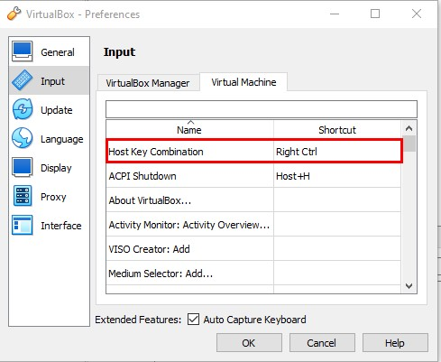
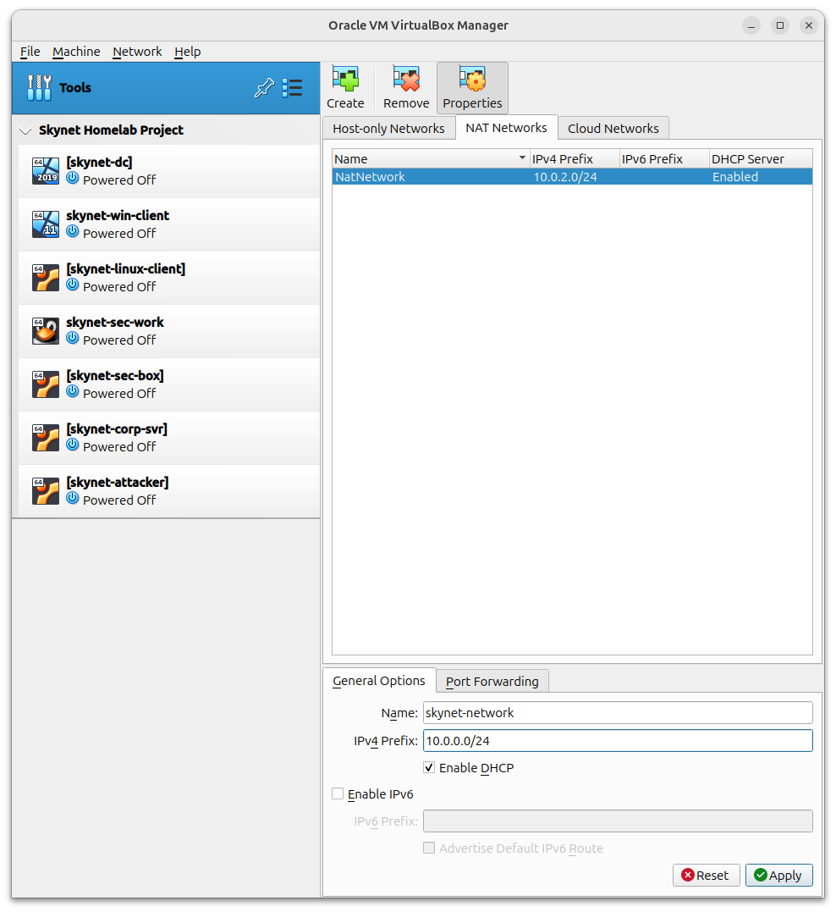

# 🧰 Installing VirtualBox on Ubuntu (From Official Site)

I installed **VirtualBox version 7.0.26r168464** by downloading the `.deb` package directly from the official Oracle VirtualBox website.

### Installation Steps:

1. **Go to the official download page**  
   👉 [https://www.virtualbox.org/wiki/Linux_Downloads](https://www.virtualbox.org/wiki/Linux_Downloads)

2. **Download the Debian package** for your Ubuntu version (e.g., `Ubuntu 20.04`, `22.04`, etc.)

3. **Install the package using your terminal**
   ```bash
   cd ~/Downloads
   sudo dpkg -i virtualbox-7.0_*.deb

4. **Fix any missing dependencies (if needed)**
   ```bash
   sudo apt --fix-broken install

5. **Verify the installation**
   ```bash
   virtualbox --help

VirtualBox is now ready for use. I use it to run virtual machines as part of my cybersecurity homelab setup.
   ```
   ✅ Version installed: VirtualBox 7.0.26r168464 on Ubuntu Linux
   ```
---
## Host Key in VirtualBox

The **Host Key** is a special key (typically the **Right CTRL**) that lets you interact with VirtualBox instead of the guest operating system inside the virtual machine (VM). It's used to exit the VM and return to the host system.

### Default Host Key:

- The default is usually the **Right CTRL** key, but it may vary based on your system or preferences.

**Purpose:**

The Host Key allows you to:

**1. Release Input:** If the VM has captured your keyboard or mouse, pressing the Host Key returns control to the host system.

**2. Access VirtualBox Features:** Use key combinations to perform actions like switching to full-screen, capturing screenshots, or opening the VirtualBox menu.

To check your current Host Key, go to **File ➔ Preferences** in VirtualBox.


Go to **Input ➔ Host Key Combination** to view or change the Host Key. To set a new key, select the box and press the desired key on your keyboard.



---
**Set Up a New NAT Network in VirtualBox**

We’ll use a NAT Network to connect Virtual Machines (VMs) to each other and the internet.

1. Open VirtualBox.
2. Go to **File ➔ Tools ➔ Network Manager**.
3. Create a new NAT Network.


Select NAT Networks ➔ “Create”. 


At the bottom, name the NatNetwork “skynet-network” and choose an IPv4 prefix, refer to the Project Overview guide for more detail on IPv4 prefixes. Select “Apply” to save changes. 



> 💡 **Note**: By default, the “skynet-network” NAT Network will be selected for all newly provisioned Virtual Machines.
