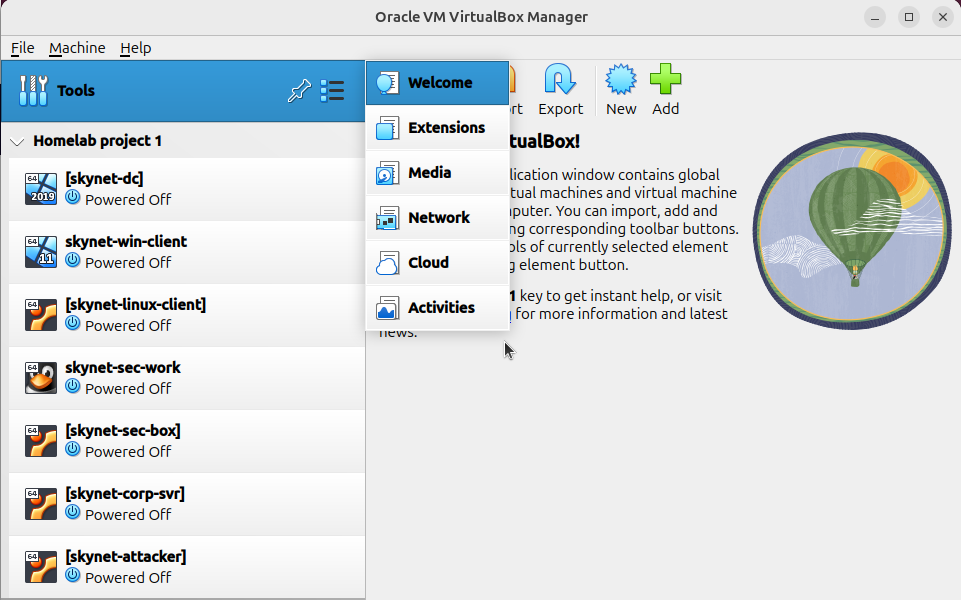

## Creating the VirtualBox NAT Network

As part of setting up my project environment, I created a custom NAT Network in VirtualBox to allow internal communication between virtual machines. Below are the steps I followed:

### Steps Taken

1. Opened **VirtualBox**.
2. Navigated to the **Tools** section.
3. Clicked the **Network** icon in the top-right corner.
4. In the **Network Manager**, selected the **NAT Networks** tab.
5. Clicked **Create** to add a new NAT network.
6. Renamed the new network to `skynet-network`.
7. Set the **IPv4 Prefix** to `10.0.0.0/24`.
8. Enabled the **DHCP** option.
9. Clicked **Apply** to save the configuration.
> 📸 
> 
### Outcome

This created a NAT network named `skynet-network` with the subnet `10.0.0.0/24`. DHCP is enabled, allowing virtual machines connected to this network to automatically receive IP addresses.

## Connecting Virtual Machines to the NAT Network

Once the `skynet-network` NAT Network was created, I configured each virtual machine in the project to connect to it. This allows all VMs to communicate over the same internal network.

### Steps Taken for Each VM

1. Open **VirtualBox**.
2. Select a virtual machine and click **Settings**.
3. Go to the **Network** tab.
4. Under **Adapter 1**, ensure the checkbox **Enable Network Adapter** is checked.
5. In the **Attached to:** dropdown, select **NAT Network**.
6. In the **Name** dropdown (next to it), select `skynet-network`.
7. Click **OK** (or **Apply**) to save the changes.
> 📸 
### Outcome

Each VM is now attached to the same NAT Network (`skynet-network`), allowing them to communicate with one another via internal IP addresses managed by the VirtualBox DHCP server.

## Hosts

| Hostname \[`skynet-…`\]           | IP Address                 | Function                              |
|--------------------------------------|-----------------------------|----------------------------------------|
| -dc (corp.skynet-dc.com)          | 10.0.0.5                   | Domain Controller (DNS, DHCP, SSO)     |
| -admin                               | 10.0.0.8                   | Corporate Server                        |
| -sec-box                             | 10.0.0.10                  | Dedicated Security Server              |
| -sec-work                            | 10.0.0.103 or (dynamic)    | Security Playground                    |
| -win-client                          | 10.0.0.100 or (dynamic)    | Windows Workstation                    |
| -linux-client                        | 10.0.0.101 or (dynamic)    | Linux Desktop Workstation             |
| attacker                             | dynamic                    | Attacker Environment                   |
