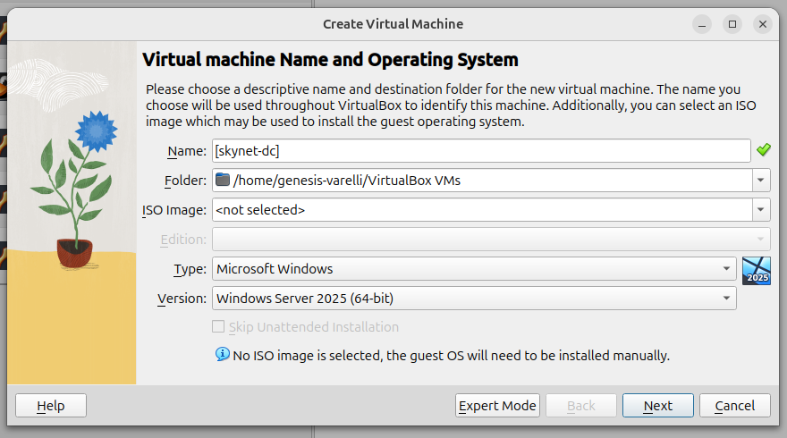

# Skynet Network Setup (Corp environment)

- Skynet is fake business environment that builds software for consumers.
- Skynet is a Windows-native.
- Future Developments:
   - Are looking to build an on-premise/cloud hybrid infrastructure.
   - Grow their Security Operations Center & Threat Detection and Response capabilties.
   - Build dedicated Security Analysis Lab.
   - simulate various cyber-attacks.

## Create Active Directory Domain controller server (Windows 2025)

### Step 2: Setting Up AD in VirtualBox

1. **Open VirtualBox** and click on **"New"** to create a new VM.
2. Name your VM exactly as listed in the table (e.g., `skynet-dc`).
3. Choose a **Folder** on your computer to save the VM files.
4. VirtualBox will usually guess the **OS Type** for you. If it doesn’t, manually select (e.g., "Windows 2025 (64-bit)").
   
5. Set the **Base Memory & Processors** according to the specs in the table (e.g., `skynet-dc` gets 4096 MB of RAM and 2 CPUs).
    !(img/ad1.png)
6. For the **Hard Disk**, select "Create a virtual hard disk now," then make sure to **uncheck "Pre-allocate Full Size"** for dynamic allocation. Set the disk size based on the **Storage (Minimum)** in the table (e.g., 50 GB for `skynet-dc`).
    !(img/ad2.png)
7. **Network Setup**: 
   - Once your VM is created, but **before starting it**, go to **Settings > Network**.
   - Set **Adapter 1** to **"NAT"** so the VM can access the internet.
   - If you need the VMs to communicate with each other, add extra network adapters set to **"Internal Network"** and give them a consistent name (e.g., `skynet-network`).
8. Click **"Finish"** to complete the setup.
9. To **install the OS**, select the VM, click **"Start"**, and follow the on-screen instructions using the mounted ISO.

Repeat this process for each VM you need to set up.
