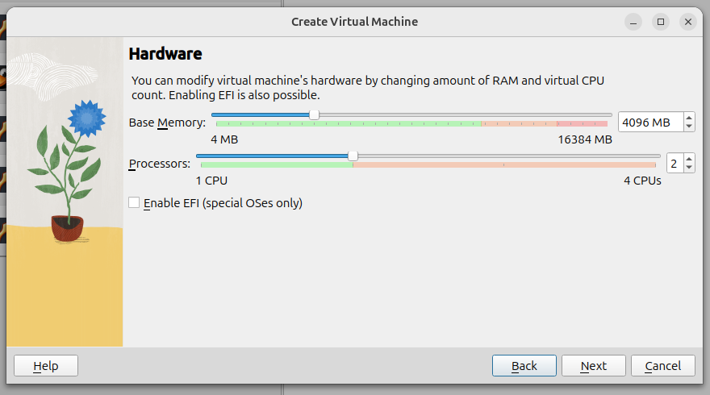
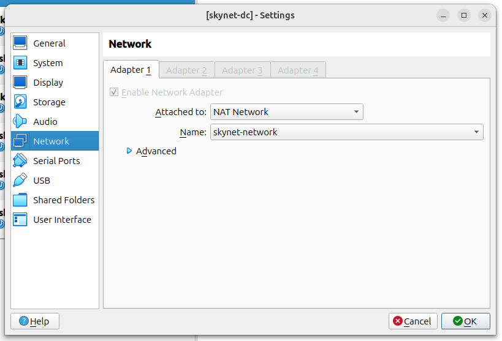
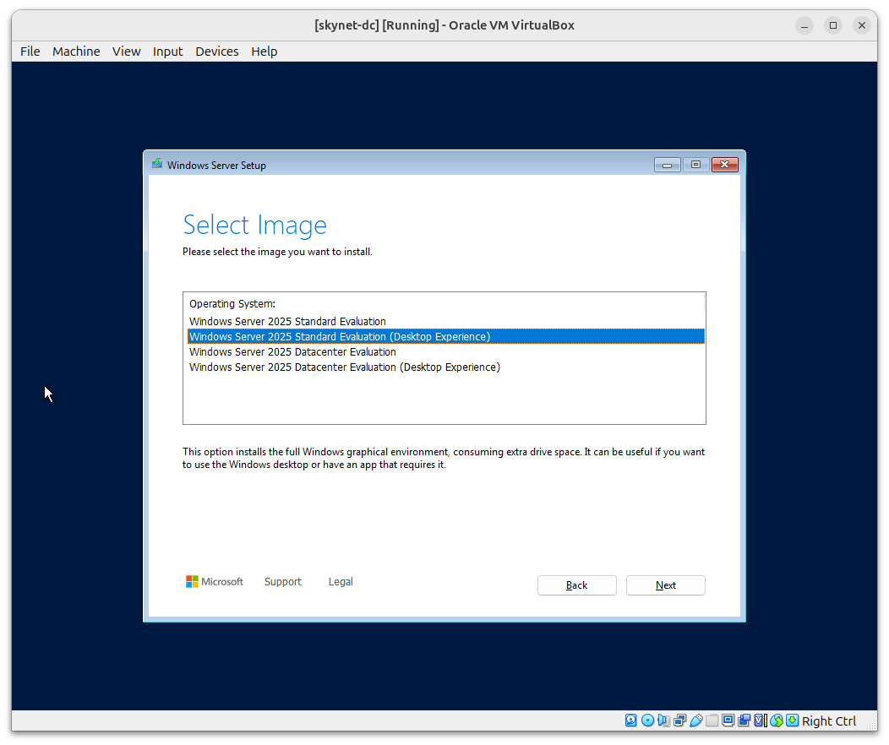
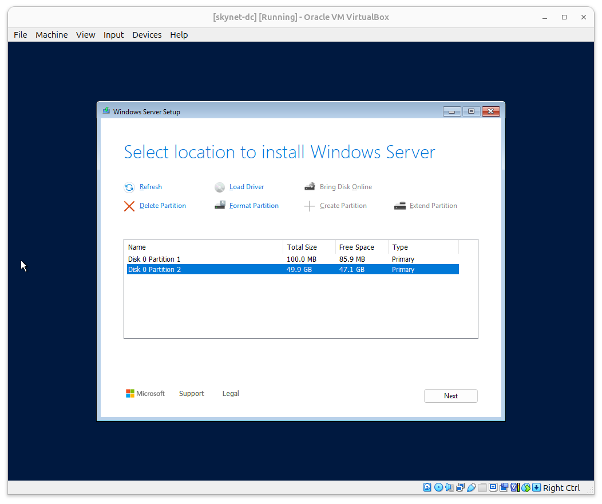

# Skynet Network Setup (Corp environment)

- Skynet is fake business environment that builds software for consumers.
- Skynet is a Windows-native.
- Future Developments:
   - Are looking to build an on-premise/cloud hybrid infrastructure.
   - Grow their Security Operations Center & Threat Detection and Response capabilties.
   - Build dedicated Security Analysis Lab.
   - simulate various cyber-attacks.

## Build Directory services server (Windows 2025)

### Step 1: Setting Up AD in VirtualBox

1. **Open VirtualBox** and click on **"New"** to create a new VM.
2. Name your VM exactly as listed in the table (e.g., `skynet-dc`).
3. Choose a **Folder** on your computer to save the VM files.
4. VirtualBox will usually guess the **OS Type** for you. If it doesn’t, manually select (e.g., "Windows 2025 (64-bit)").
5. For the ISO Image, click the arrow and select the OS you downloaded (e.g, Windows Server 2025.iso)
   
   
6. Set the **Base Memory & Processors** according to the specs in the table (e.g., `skynet-dc` gets 4096 MB of RAM and 2 CPUs).
   
    
7. For the **Hard Disk**, select "Create a virtual hard disk now," then make sure to **uncheck "Pre-allocate Full Size"** for dynamic allocation. Set the disk size based on the **Storage (Minimum)** in the table (e.g., 50 GB for `skynet-dc`).
   
    
8. **Network Setup**: 
   - Once your VM is created, but **before starting it**, go to **Settings > Network**.
   - Set **Adapter 1** to **"NAT"** so the VM can access the internet.
   - If you need the VMs to communicate with each other, add extra network adapters set to **"Internal Network"** and give them a consistent name (e.g., `skynet-network`).
     
9. Click **"Finish"** to complete the setup.
10. To **install the OS**, select the VM, click **"Start"**, and follow the on-screen instructions using the mounted ISO.
 

## Active Directory installation
### Step 2: Installing Windows Server (Active Directory Control Server)

To set up the Active Directory Control Server, I followed these steps:

1. **Started the VM** I created for the Active Directory Control Server in VirtualBox.
2. Once the server booted up, I clicked **Next** and **Next** again to begin the installation process.
3. I selected **Windows Server** as the operating system to install, then clicked **Next** to proceed.
   
   
5. I **agreed to the Microsoft Licensing Terms** by clicking **Accept**.
6. I chose the **Desktop Experience** option, which ensures the installation of a graphical user interface (GUI) for easier management, then clicked **Next**.
   
 
7. For the disk partition, I selected **Partition 2** (the one with the largest size), then clicked **Next** and **Install** to begin the OS installation.
   
   
8. The installation took a while, and the server restarted a few times during the process.

After this step, Windows Server is successfully installed with a GUI, and I'm ready to proceed with setting up Active Directory and other roles.

