# Skynet Network Setup (Corp Environment)

## Build Directory Services Server (Windows Server 2025)

### Step 1: Setting Up Active Directory in VirtualBox

1. **Open VirtualBox** and click **"New"** to create a new VM.
2. **Name your VM** exactly as listed in the table (e.g., `skynet-dc`).
3. Choose a **Folder** to store the VM files.
4. VirtualBox should automatically detect the **OS Type**. If it doesn’t, select **Windows Server 2025 (64-bit)**.
5. Select the **ISO Image** (e.g., `Windows Server 2025.iso`) for the OS you downloaded.
   
   
   
6. Set the **Base Memory & Processors** based on the specs in the table (e.g., `skynet-dc` gets 4096 MB RAM and 2 CPUs).

    

7. For the **Hard Disk**, select "Create a virtual hard disk now" and ensure **"Pre-allocate Full Size"** is unchecked for dynamic allocation. Set the disk size based on the **Storage (Minimum)** in the table (e.g., 50 GB for `skynet-dc`).
   
    

8. **Network Setup**: 
   - Once your VM is created (before starting it), go to **Settings > Network**.
   - Set **Adapter 1** to **"NAT"** for internet access.
   - Add extra adapters for VM-to-VM communication with **"Internal Network"** and assign them a consistent name (e.g., `skynet-network`).

    

9. Click **"Finish"** to complete the VM creation.
10. To **Install the OS**, select the VM, click **"Start"**, and follow the on-screen instructions using the mounted ISO.

---

### Step 2: Installing Windows Server (Active Directory Control Server)

1. **Start the VM** you created for the Active Directory Control Server in VirtualBox.
2. Click **Next** and **Next** to begin the installation process.
3. Choose **Windows Server** from the available operating systems and click **Next**.
   
   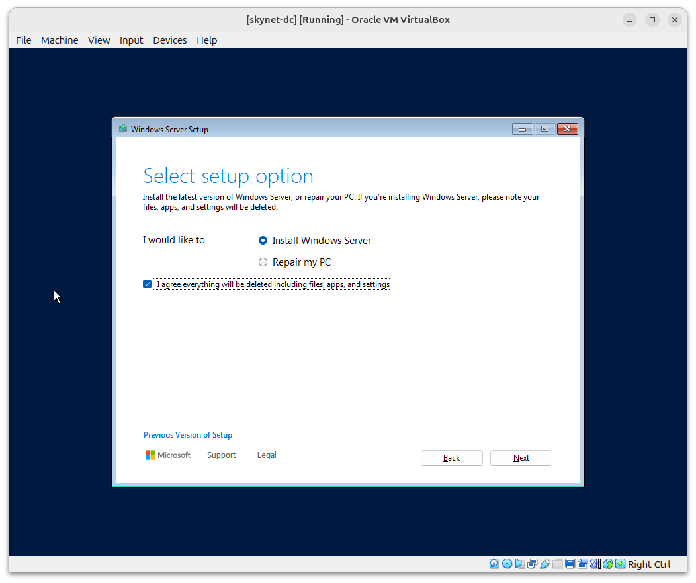

4. **Agree to the Microsoft Licensing Terms** by clicking **Accept**.
5. Select the **Desktop Experience** option (this installs the graphical user interface for easier management) and click **Next**.

   

6. Select **Partition 2** (the one with the largest size) and click **Next** followed by **Install** to start the installation.

   

7. The server will restart a few times, completing the installation.

Now, Windows Server is installed with a GUI, and we're ready to proceed with the Active Directory setup.

---

### Step 3: Setting Up the Administrator Account

During installation, I was prompted to set up the **Administrator account**:

1. Set up the **username** for the Administrator account (the default password is listed in the project overview).
2. Enter a **password** that meets the required security criteria (mix of letters, numbers, and special characters).
3. Click **Next** to proceed.

**Note:** I recommend using the default credentials listed in the project overview for consistency.

---

### Step 4: Finalising Settings for the Windows Server VM

Once the server VM was up and running, I made a few adjustments:

1. **Log in to the VM**:
   - In the VM tab, click the **input bar** and select **Keyboard > Ctrl+Alt+Del** to prevent locking out the system.
   - Enter the **password** you set earlier.

2. **Confirm Server Manager Panel**:
   - After logging in, the **Server Manager** panel popped up, confirming that the system is ready for domain controller configuration.

3. **Adjust Default Settings**:
   - By default, Windows Server has a **5-minute screen timeout**, which can be annoying when switching between VMs. To change this:
     - Go to **Settings > Power & Battery > Screen Timeout**, set it to **Never**, and click **Save**.

4. **Disable Ctrl+Alt+Del Requirement**:
   - Since we won't be logging out, I disabled the **Ctrl+Alt+Del** requirement:
     - Open **Windows Search**, type **"Local Computer"**, and select **"Edit Group Policy"** to open the **Local Group Policy Editor**.
     - Navigate to **Computer Configuration > Windows Settings > Security Settings > Local Policies > Security Options**.
     - Scroll down and double-click on **"Interactive login: Do not require Ctrl+Alt+Del"**, set it to **Enabled**, click **Apply**, then **OK**.

   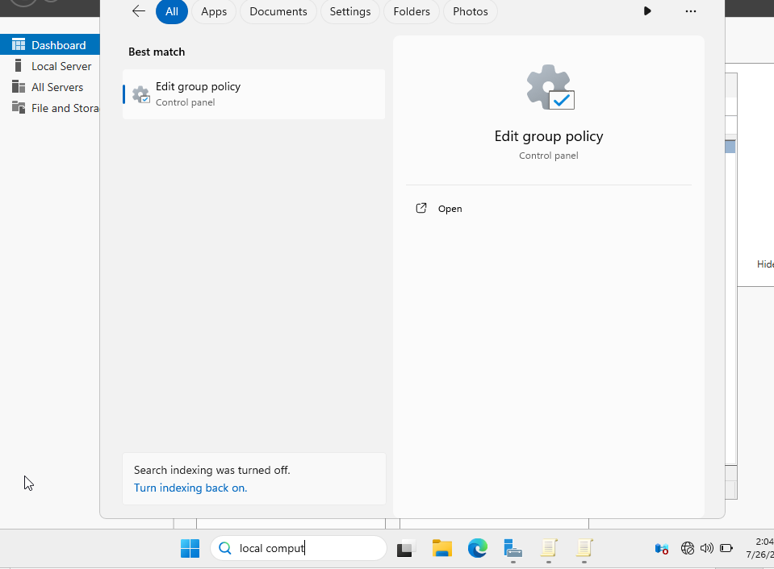

   

5. **Enable Full Integration Features**:
   - To enhance the VM experience (full screen, shared clipboard, and drag & drop), I followed these steps:
     1. Start the VM.
     2. In the **VirtualBox menu bar**, go to **Devices → Insert Guest Additions CD Image**.

     

     3. Run the installer inside the VM when prompted.
     4. After installation, reboot the VM.
     5. Enable integration features via:
        - **Machine → Settings → General → Advanced → Shared Clipboard → Bidirectional**
        - **Devices → Drag and Drop → Bidirectional**

     

---

Now, the Windows Server VM is fully set up, and we can proceed with the domain controller configuration.

## Directory Services Server Configuration

### Step 1: Apply Static IP Address

To ensure that your machine has a consistent network address and doesn't change over time, we will configure a static IP address. This is crucial, especially if other machines rely on it for network communication.

### Instructions:
1. Open **Control Panel**:
    - Search for "Control Panel" in the Start menu and open it.
    
2. Go to **Network and Sharing Center**:
    - Navigate to **Network and Sharing Center** > **Change adapter settings**.

3. Modify Ethernet Adapter:
    - Right-click on the **Ethernet** adapter and select **Properties**.
    - In the list, select **Internet Protocol Version 4 (TCP/IPv4)** and click **Properties** again.
      
   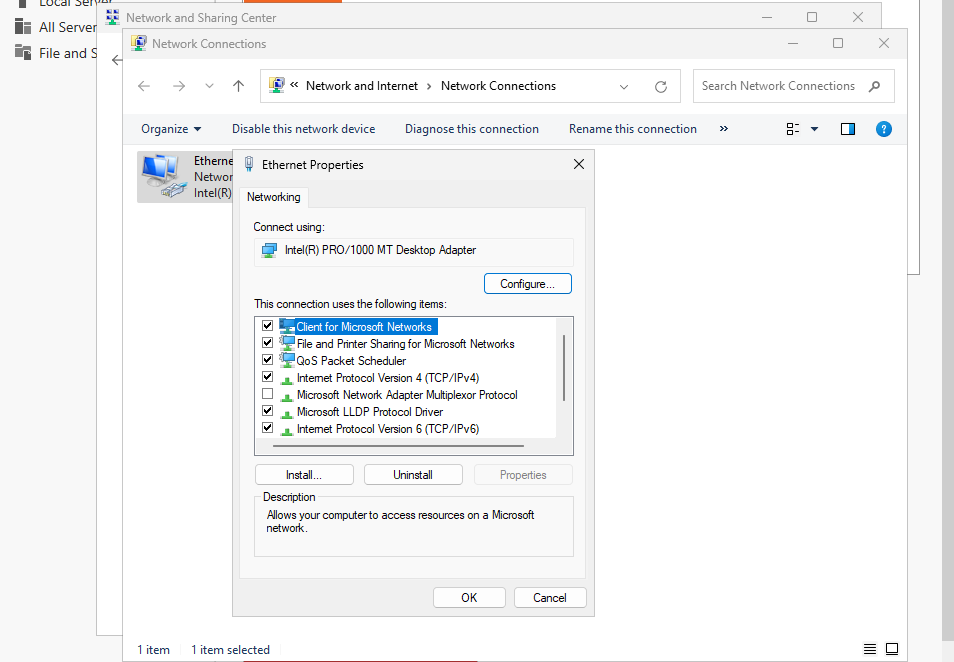
4. Configure Static IP:
    - Select **Use the following IP address**.
    - Enter the following values:
        - **IP Address**: `10.0.0.5`
        - **Subnet Mask**: `255.255.255.0`
        - **Default Gateway**: `10.0.0.1`
          
   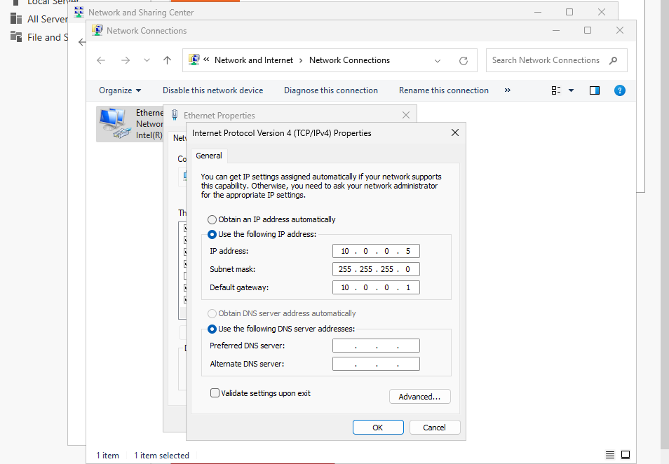
5. **Subnet Overview**:
    - This setup is consistent with the VirtualBox NAT Network configuration I created earlier. 
    - The subnet `255.255.255.0` (or `/24`) allows for 254 usable IP addresses, from `10.0.0.1` to `10.0.0.254`.

Make sure to follow the original host setup cheatsheet from the overview page for reference.

### Step 2: Install Roles and Features

The **Server Manager** is the main interface you’ll interact with on Windows Server 2025. From here, you can add different roles and features to extend the functionality of the server.

### Instructions:

1. **Open Server Manager**:
    - Launch **Server Manager** (this is the main window for managing your server).
      
   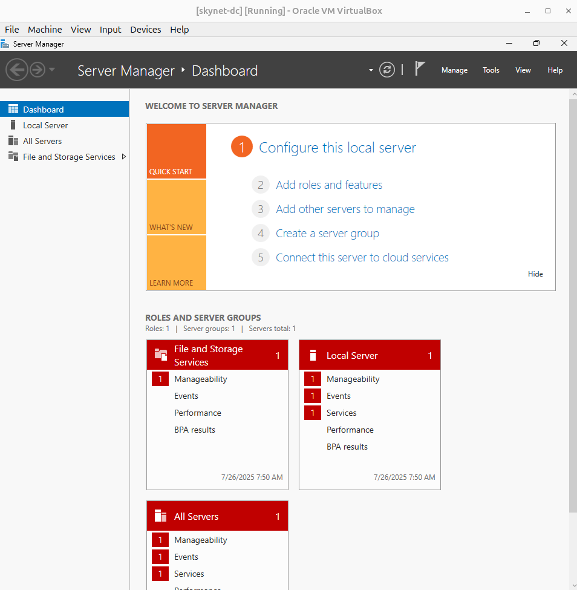
   
3. **Add Roles and Features**:
    - Click **Add Roles and Features** to begin the installation process.

4. **Use Default Wizard**:
    - Go through the default configurations in the wizard and click **Next**.
      
   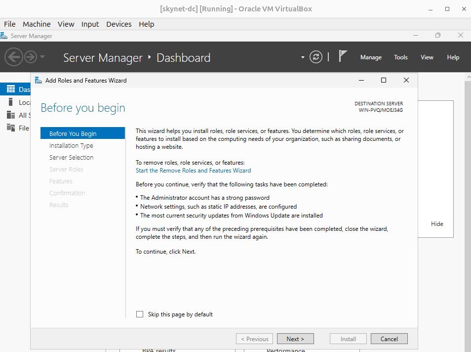

5. **Role-Based Installation**:
    - Select **Role-based or feature-based installation** and click **Next**.

6. **Select Destination Server**:
    - In the **Select destination server** section, choose the default server (`10.0.0.5`) and click **Next**.

   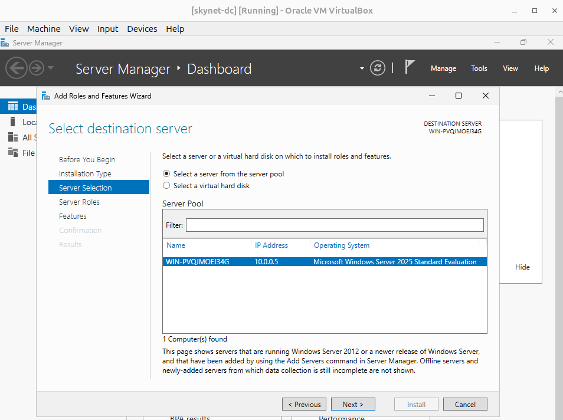
   
8. **Install Active Directory Domain Services (AD DS)**:
    - Under **Server Roles**, select **Active Directory Domain Services**.
    - Click **Add Features** when prompted, then click **Next**.
      
   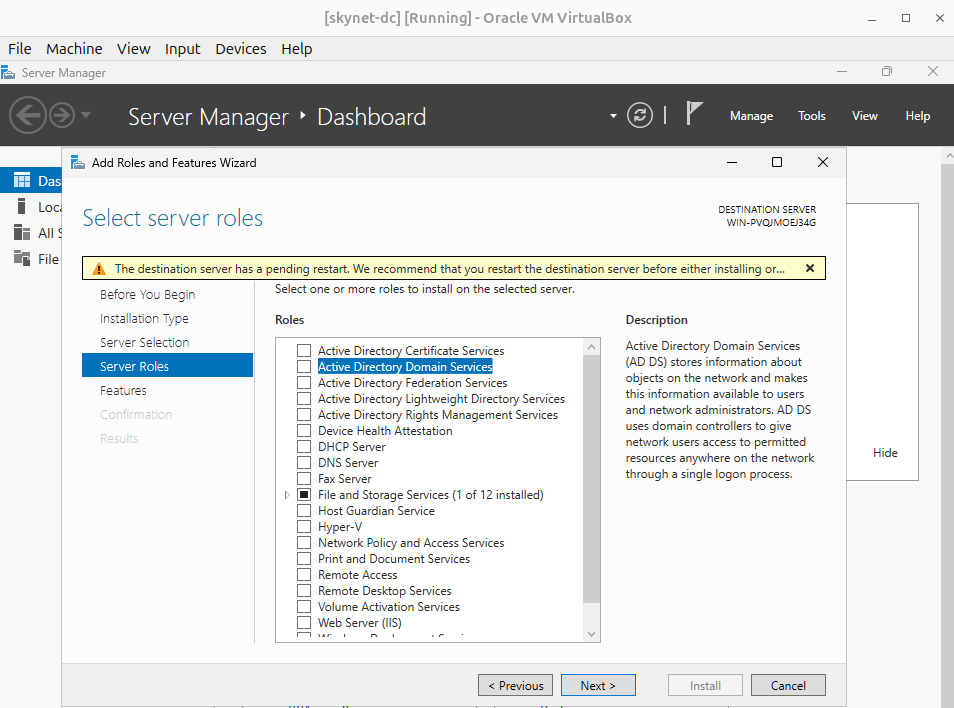
   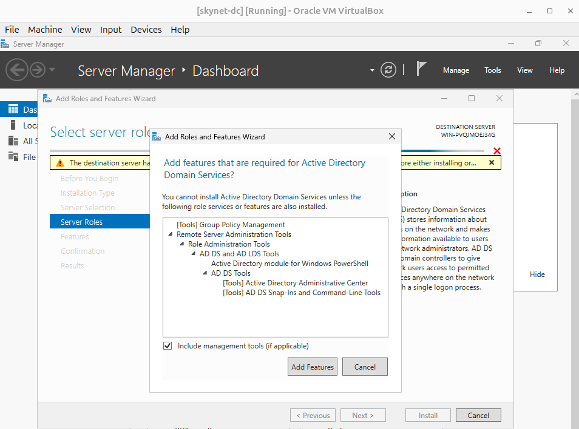
   
10. **Install DHCP Server**:
    - Similarly, select **DHCP Server** and click **Add Features**.
    - Click **Next**.

    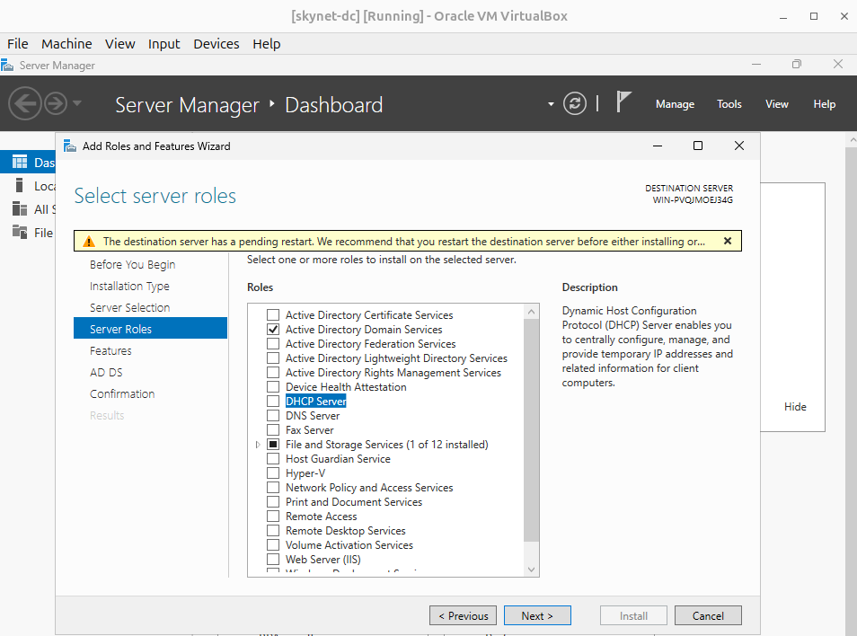
    
    
12. **Install DNS Server**:
    - Do the same for the **DNS Server** role: select it and click **Add Features**.
    - Click **Next**.
      
   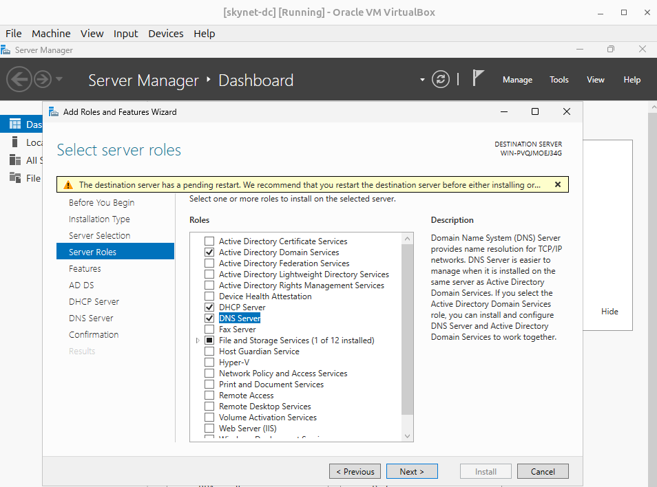
   
13. **Complete Installation**:
    - Continue clicking **Next** through all the default pages.
    - On the **Confirmation** page, click **Install** to begin the installation process.

      

The server will now install the selected roles, extending its functionality to include AD DS, DHCP, and DNS.
